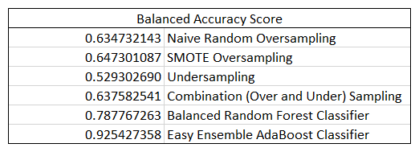
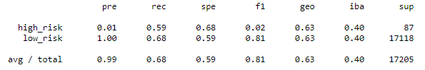
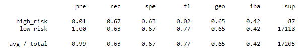
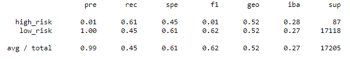
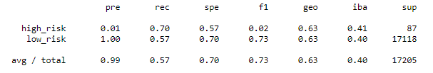
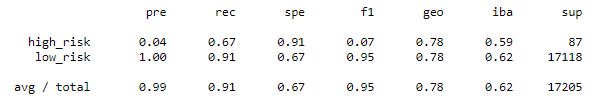
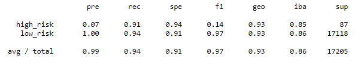

# Credit_Risk_Analysis

## Purpose:
#### loan prediction risk analysis
#### The purpose of this analysis is well defined (4 pt)

## Results:

#### There is a bulleted list that describes the balanced accuracy score and the precision and recall scores of all six machine learning models (15 pt)
#### 
####
#### Random Over Sampling
####  
####
#### SMOTE
####   
####
#### Under Sampling
#### 
####
#### Combo Sampling
#### 
####
#### Balanced
#### 
####
#### Easy E
#### 

## Summary:

#### There is a summary of the results (2 pt)
#### There is a recommendation on which model to use, or there is no recommendation with a justification (3 pt)
